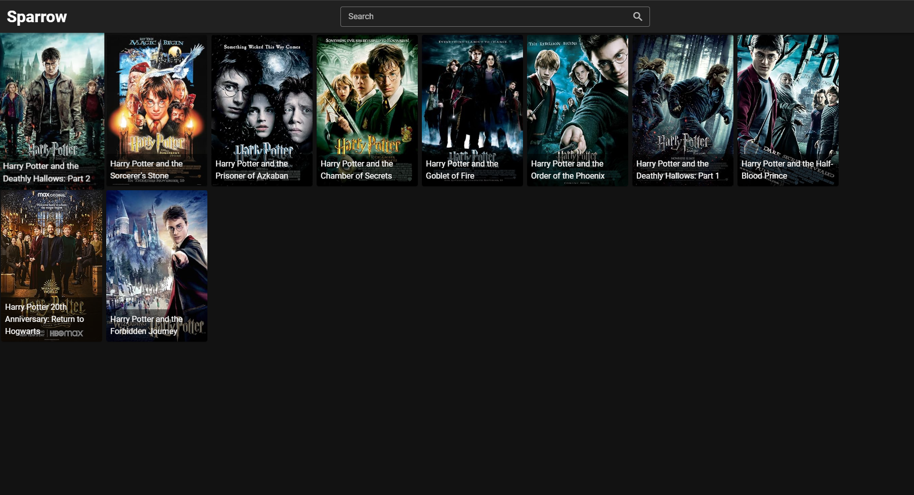
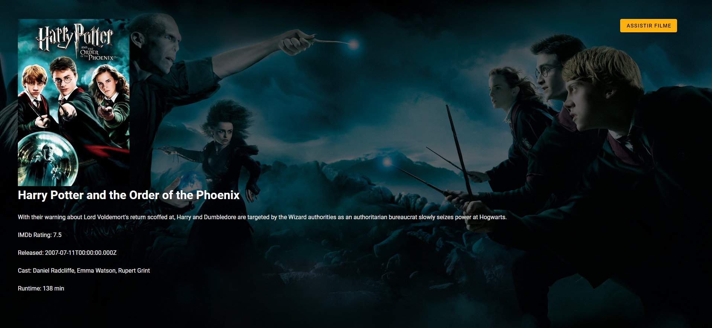
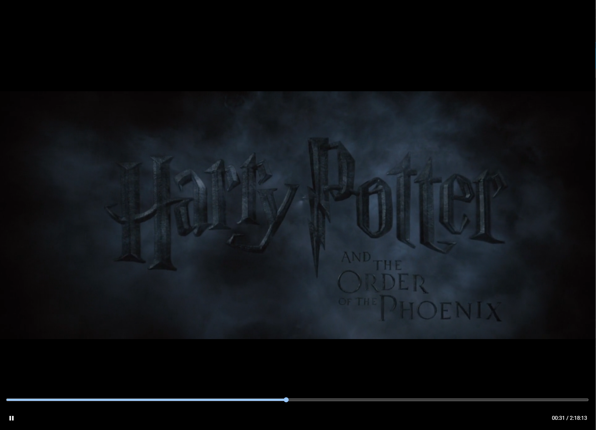

# Sparrow

Sparrow (from Jack Sparrow the pirate) is a web app that allows users to search for movies and TV shows with torrents and watch them through a frontend web interface (TODO) using the HLS protocol. It has quite similar features to Stremio, but the game-changer is that it can run in a Docker container anywhere (cloud or home server) and the web app can be accessed from anywhere (mobile, TV, console...).

## Frontend

The frontend app is built with Vue.js and Vuetify. It is available in the [frontend repository](https://github.com/cabraljv/sparrow-frontend).

## Features
- [x] Search movies by title (currently using the OMDB API)
- [ ] Get more information about a movie (description, rating, casting, etc)
- [x] Check if a movie is available to watch (if it has seeders and a torrent available)
- [x] Try to watch an available movie starting the torrent download, encoding it to hls and serving it to the user
- [ ] Save data to continue watching a movie later

## Current development status
- Home page:

- Movie page:

- Player:

